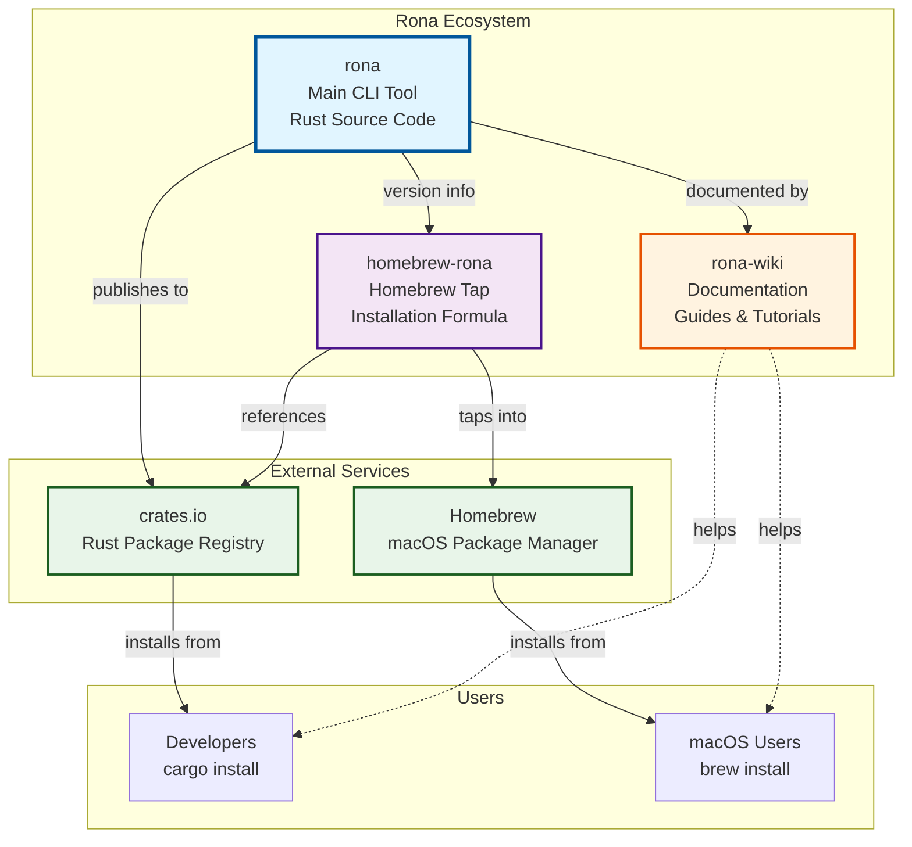
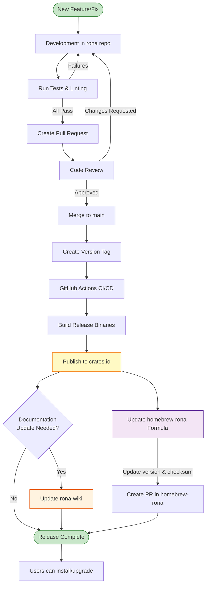
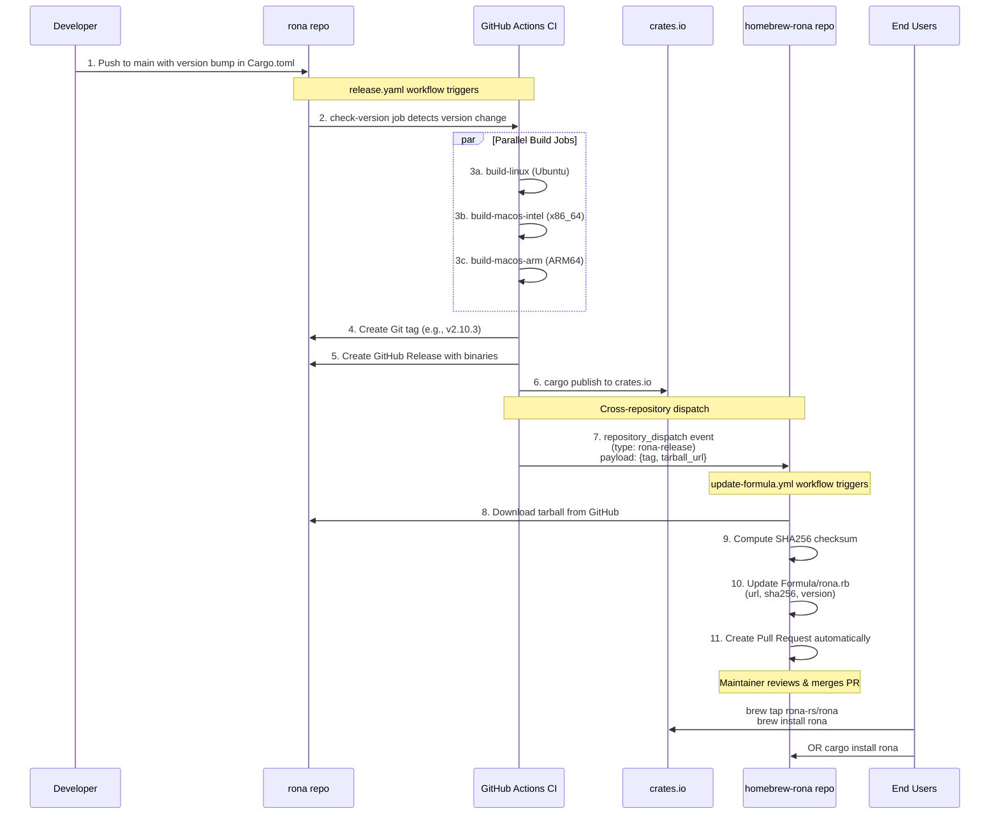

# 🔌 Rona Organization

<h2 align="center">
  A powerful CLI tool to streamline your Git workflow
</h2>
<p align="center">
  
  
</p>


## About

**Rona** is a command-line interface tool designed to enhance your Git workflow with powerful features and intuitive commands. Built with Rust for performance and reliability, Rona simplifies common Git operations and provides additional functionality for managing commits, files, and repository status.

## Key Features

- 🚀 **Intelligent File Staging** - Pattern-based file exclusion with support for multiple patterns
- 📝 **Structured Commit Messages** - Interactive commit type selection with customizable templates
- 🔄 **Streamlined Push Operations** - One-command commit and push workflows
- 🎯 **Customizable Configuration** - Global and project-level TOML configuration files
- 🎨 **Template System** - Flexible commit message formatting with variables
- 🛠 **Multi-Shell Support** - Completions for Bash, Fish, Zsh, and PowerShell
- 🔐 **GPG Signing** - Auto-detected commit signing with GPG
- ⚙️ **Flexible Editor Support** - Works with any command-line editor (vim, nano, code, zed, etc.)

## Quick Start

### Installation

**Via Cargo:**
```bash
cargo install rona
rona init vim  # Initialize with your preferred editor
```

**Via Homebrew:** (WIP)
```bash
brew tap rona-rs/rona
brew install rona
rona init vim
```

### Basic Usage

```bash
# Stage files (excluding specific patterns)
rona -a "*.log" "*.tmp"

# Generate commit message (interactive mode)
rona -g -i

# Commit and push
rona -c -p
```

## Repositories

### [rona](https://github.com/rona-rs/rona)
The main repository containing the Rona CLI tool source code.
- Written in Rust 🦀
- Comprehensive test suite
- Continuous integration with GitHub Actions
- Published to [crates.io](https://crates.io/crates/rona)

### [rona-wiki](https://github.com/rona-rs/rona-wiki)
Comprehensive documentation and guides for Rona.
- [Installation Guide](https://github.com/rona-rs/rona-wiki/blob/main/Installation.md)
- [Features Overview](https://github.com/rona-rs/rona-wiki/blob/main/Features.md)
- [Usage Guide](https://github.com/rona-rs/rona-wiki/blob/main/Usage-Guide.md)
- [Command Reference](https://github.com/rona-rs/rona-wiki/blob/main/Command-Reference.md)
- [Shell Integration](https://github.com/rona-rs/rona-wiki/blob/main/Shell-Integration.md)
- [FAQ](https://github.com/rona-rs/rona-wiki/blob/main/FAQ.md)

### [homebrew-rona](https://github.com/rona-rs/homebrew-rona)
Official Homebrew tap for macOS users.
- Easy installation via `brew tap`
- Automatic updates with `brew upgrade`
- Includes setup guides and quick start documentation

## Repository Architecture

The Rona project consists of three interconnected repositories that work together to provide a complete ecosystem for users and contributors. Understanding how these repositories interact helps clarify the development and release process.

### Repository Relationships



### Release & Deployment Workflow



### How It Works

**Development Cycle:**
1. **rona** is the source of truth - all development happens here
2. When features are complete and tested, a new version is tagged
3. The CI/CD pipeline automatically builds and publishes to **crates.io**
4. The **homebrew-rona** formula is updated to reference the new version
5. The **rona-wiki** is updated if new features require documentation changes

**User Installation Paths:**
- **Rust Developers**: Install directly from crates.io using `cargo install rona`
- **macOS Users**: Install via Homebrew using `brew tap rona-rs/rona && brew install rona`
- **All Users**: Reference the **rona-wiki** for comprehensive guides and documentation

**Repository Dependencies:**
- **homebrew-rona** depends on **rona** for version information and release artifacts
- **rona-wiki** documents **rona** features and usage patterns
- Both **homebrew-rona** and **rona-wiki** must be updated when significant changes occur in **rona**

### GitHub Actions Coordination

The three repositories use sophisticated cross-repository automation to coordinate releases and updates automatically. Here's how the GitHub Actions workflows communicate:



**Automation Details:**

1. **Version Detection** (`rona/.github/workflows/release.yaml`):
   - Monitors `Cargo.toml` for version changes
   - Compares current version with the latest Git tag
   - Only triggers release jobs if version has changed

2. **Parallel Builds**:
   - Three jobs run simultaneously to build binaries:
     - `build-linux`: Ubuntu runner for Linux x86_64
     - `build-macos-intel`: macOS runner with x86_64 target
     - `build-macos-arm`: macOS runner with aarch64 target
   - Each job creates compressed tarballs with SHA256 checksums

3. **Publishing to crates.io**:
   - Happens in the `build-linux` job after binary creation
   - Uses `CRATES_IO_TOKEN` secret for authentication
   - Runs `cargo publish --dry-run` first to validate

4. **Cross-Repository Communication**:
   - After all builds complete, `notify-homebrew` job runs
   - Checks if a PR already exists (prevents duplicates)
   - Uses `repository_dispatch` with custom event type `rona-release`
   - Passes version tag and tarball URL as JSON payload
   - Requires `HOMEBREW_RONA_TOKEN` secret with repo write access

5. **Automatic Formula Update** (`homebrew-rona/.github/workflows/update-formula.yml`):
   - Listens for `repository_dispatch` events
   - Downloads tarball and computes SHA256 using `get-checksum.sh`
   - Updates `Formula/rona.rb` with:
     - New version tag
     - Updated tarball URL
     - Fresh SHA256 checksum
     - Updated test assertions
   - Creates a pull request automatically
   - PR title: `rona: bump to v2.10.3`
   - Branch: `bump/rona-v2.10.3`

6. **Manual Steps**:
   - Maintainer reviews and merges the Homebrew formula PR
   - Documentation updates in **rona-wiki** are done manually when features change

**Security Considerations:**
- Uses GitHub PAT tokens for cross-repository access
- `HOMEBREW_RONA_TOKEN`: Allows rona repo to trigger workflows in homebrew-rona
- `CRATES_IO_TOKEN`: Authenticates publishing to crates.io
- All secrets are stored securely in GitHub repository settings

## Documentation

- **[Wiki Home](https://github.com/rona-rs/rona-wiki)** - Start here for comprehensive documentation
- **[Installation Guide](https://github.com/rona-rs/rona-wiki/blob/main/Installation.md)** - Multiple installation methods
- **[Usage Guide](https://github.com/rona-rs/rona-wiki/blob/main/Usage-Guide.md)** - Learn how to use Rona effectively
- **[Command Reference](https://github.com/rona-rs/rona-wiki/blob/main/Command-Reference.md)** - Complete command documentation
- **[Contributing](https://github.com/rona-rs/rona/blob/main/CONTRIBUTING.md)** - Guidelines for contributors

## Development

### Requirements
- Rust 2021 edition or later
- Git 2.0 or later

### Building from Source
```bash
git clone https://github.com/rona-rs/rona.git
cd rona
cargo build --release
```

### Running Tests
```bash
cargo test --workspace
```

### Linting
```bash
cargo clippy --workspace --release --all-targets --all-features -- \
  --deny warnings -D warnings \
  -W clippy::correctness \
  -W clippy::suspicious \
  -W clippy::complexity \
  -W clippy::perf \
  -W clippy::style \
  -W clippy::pedantic
```

## Contributing

Contributions are welcome! Please read our [Contributing Guidelines](https://github.com/rona-rs/rona/blob/main/CONTRIBUTING.md) before submitting pull requests.

### Ways to Contribute
- Report bugs and issues
- Suggest new features
- Improve documentation
- Submit pull requests
- Star the repository

## License

All projects in the Rona organization are dual-licensed under:
- Apache License, Version 2.0 ([LICENSE-APACHE](https://github.com/rona-rs/rona/blob/main/LICENCE-APACHE))
- MIT License ([LICENSE-MIT](https://github.com/rona-rs/rona/blob/main/LICENCE-MIT))

You may choose either license at your option.

## Support

- **Issues:** [GitHub Issues](https://github.com/rona-rs/rona/issues)
- **Discussions:** [GitHub Discussions](https://github.com/orgs/rona-rs/discussions)
- **Wiki:** [Rona Wiki](https://github.com/rona-rs/rona/wiki)
